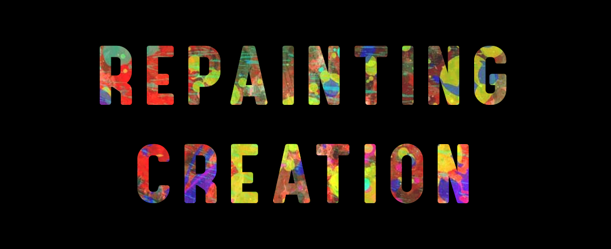
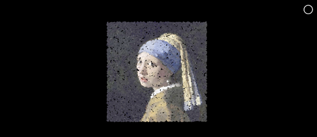
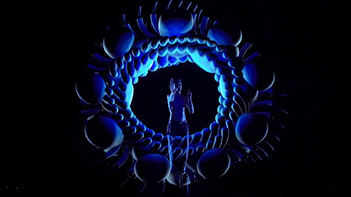
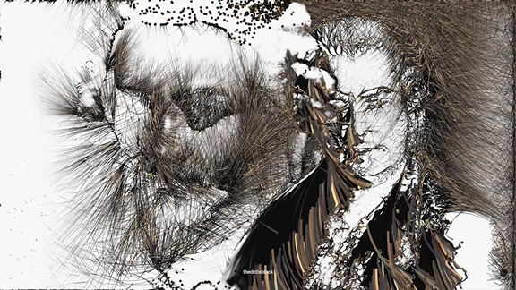
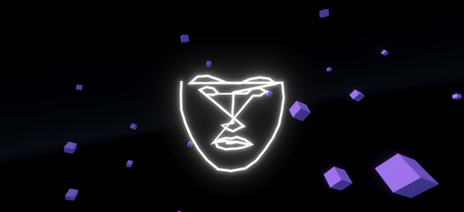
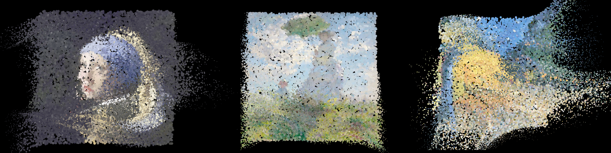
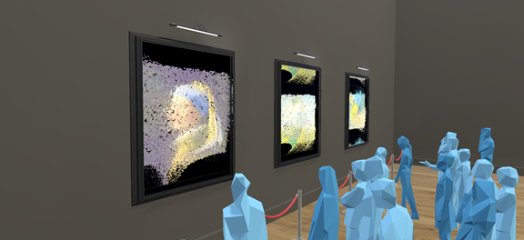

    

# Repainting Creation
## A computer vision &amp; Generative Art Project
Author: Guilherme Silva Gama 

#
## Context of the work

The following work was developed focusing on the Generative Art and Computer Vision fields and belongs to the first deliverable project of the SDI curricular unit in the FEUP&#39;s Master of Multimedia.

A concept that is usually misunderstood is the originality involved in a certain artwork. As stated in the book &quot;Steal Like an Artist&quot; [1], nothing comes from nowhere. Every artist has their different set of references, sources of inspiration and backgrounds. so therefore, all creative work builds on what came before. An oversimplified conclusion of this is that nothing, even the first or the most known artwork, is truly original.

But when it comes to a digital generative art system how are these references translated? Are they just a mere numeric pattern, hardcoded or learnt with a complex deep learning system? Are they just the seed of a seemingly random numeric pattern? The answer may not be clear.

Furthermore, considering an interactive digital system, another question could be raised. If a subject of interaction could influence the machine art generation process and if the starting point of this process was a pre-known artwork, at what point is the new generated piece considered itself original?

With the intent of answering this question, the project denominated by &quot;Repainting Creation&quot; was developed. This project aims to re-shape some of the most famous classical paintings throughout the history (ex: Girl with a Pearl Earring by Vermeer). Using the subject&#39;s facial movements, he can influence the artwork motifs and expressions. The subject also dictates when the artwork is completed and, at the end, is presented with all its creations.
  

_Figure 1 – The painting before the particle system initiates_
    

## Related works

Silicium2 - Carl Emil &amp; Bjørn Svin

Silicium2 is an audiovisual and synthetic-organic live performance [2] by the visual artist Carl Emil Carlsen and the music composer Bjørn Christiansen Svin. The performance focus on the interchangeable interaction between graphics, music and stage performance, expanding the traditional concert performance format onto a more surreal and dystopian one.

To virtualize the performer&#39;s body, the artist uses a Microsoft Kinect sensor, which tracks the body&#39;s movements and transmits that data to the interactive system. For the art generation, Carl Emil has developed a specialized graph framework in the game engine Unity.

_Figure 2 - A screenshot from Silicium2 stage performance_

Generative portraits of classical music composers -thedotisblack

This is a video-series about the process generating portraits based on original paintings [3]. In attempt to recreate the portraits of famous classical music composers (ex: Johann Sebastian Bach), the system can be seen reinterpreting the colors, contours and shades and shadows of the source image. Although many technical details were not publicly shared, the portrait generation was accomplished with the graphical library Processing.

_Figure 3 - A screenshot of Bach generative portrait by thedotisblack_

#
## Technologies &amp; System Behavior

Technologies used

The core of this project was developed using the Unity game engine and all logic was written using the C# programming language. Some external libraries were also used to suit the needs for this system.

For the animated particles that can be seen throughout the demo, the Visual Effects Graph [4] package was used. It provides high fidelity visuals while maintaining a good performance. Since in the simulation the particles behavior is processed on a GPU thread, it provides faster calculation times [5] and handles well a large number of particles without compromising performance.

For the facial recognition an in-engine integration of library OpenCV [6] was used. It also provides some implementation examples for the facial features detection and tracking, using the standard 68 points facial landmark model [7].

System Behavior

This system was designed to be interacted by one subject at time. Although the main focus of this system is the art generation itself, there three distinct scenes during the experience: the tutorial, the art generation and the gallery presentation.

_Figure 4 - Tutorial scene displaying the subject&#39;s face_
  

Tutorial scene – In this scene the user is presented with a representation of his face on a virtual space and its facial position and rotation are translated into the camera view, much like in a VR experience. The purpose is for the user to self-calibrate and learn about all the possible controls available.
  

_Figure 5 - The different paintings generated_
  
Art Generation scene – After the introductory scene the player is presented with a series of random paintings, on at a time. Each painting is formed by a collection of colored particles, corresponding to the pixel data of the original image source on a scale of 1:1 (each pixel has its equivalent particle). Using the previously learnt controls, the subject can influence the particle system with its face XYZ position and rotation. To finish a panting the user must hold the space key.

Gallery Presentation scene – After the third completed painting this scene begins, and it displays all the works done by the subject on a painting gallery/exhibition. The objective for this final scene is to make the subject reflect on the work accomplished.
  

_Figure 6 - The gallery presentation scene in action_

  

## References

| [1] | A. Kleon, Steal like an artist: 10 things nobody told you about being creative., Workman Publishing, 2012. |
| --- | --- |
| [2] | C. E. &amp;. B. Svin, &quot;A clip from Silicium2, Carl Emil&#39;s project with techno artist Bjørn Svin,&quot; Unity, 02 03 2020. [Online]. Available: https://www.youtube.com/watch?v=UtYuLnUcN3g. |
| [3] | thedotisblack creative coding, &quot;JOHANN SEBASTIAN BACH | Generative portraits of classical music composers (Processing Image Art),&quot; 18 01 2020. [Online]. Available: https://www.youtube.com/watch?v=ZzNO3FvkTJM. |
| [4] | Unity Technologies, &quot;Visual Effect Graph,&quot; [Online]. Available: https://unity.com/visual-effect-graph. |
| [5] | Mythbusters, &quot;Demo GPU versus CPU,&quot; 04 12 2009. [Online]. Available: https://www.youtube.com/watch?v=-P28LKWTzrI. |
| [6] | Paper Plane Tools, &quot;OpenCV plus Unity,&quot; 24 01 2019. [Online]. Available: https://assetstore.unity.com/packages/tools/integration/opencv-plus-unity-85928. |
| [7] | shekharpandey, &quot;Dlib 68 points Face landmark Detection with OpenCV and Python,&quot; 12 08 2021. [Online]. Available: https://www.studytonight.com/post/dlib-68-points-face-landmark-detection-with-opencv-and-python. |